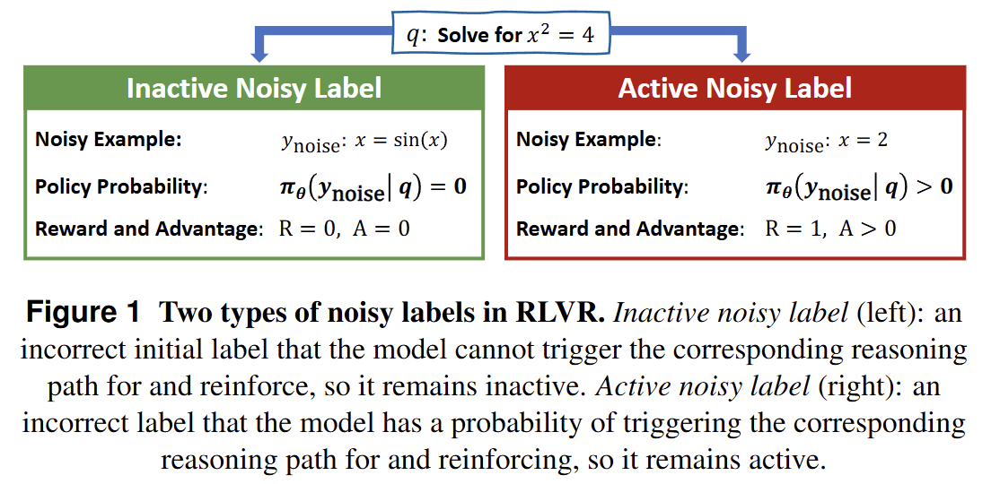
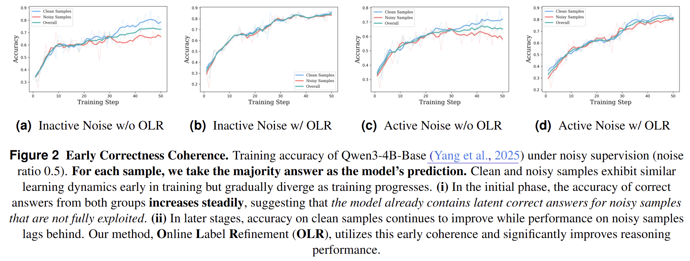
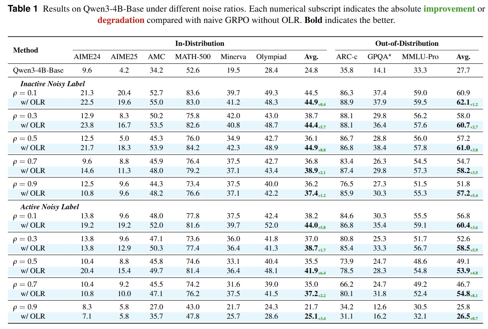
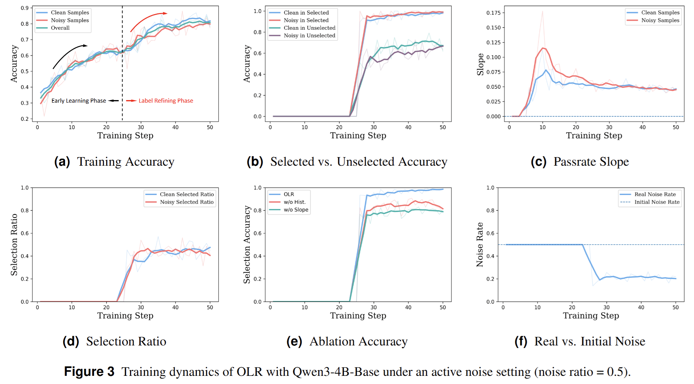

<div align="center">

## Can LLMs Learn to Reason Robustly under Noisy Supervision?

**Online Label Refinement (OLR)**

[](https://arxiv.org/abs/2604.03993)

<!-- *Shenzhi Yang, Guangcheng Zhu, Bowen Song, Sharon Li, Haobo Wang, Xing Zheng, Yingfan Ma, Zhongqi Chen, Weiqiang Wang, Gang Chen*  
*Zhejiang University · Ant Group · University of Wisconsin–Madison* -->

</div>

---

### In one sentence

Reinforcement Learning with Verifiable Rewards (RLVR) assumes abundant **clean** ground-truth labels; in practice, expert scarcity and weak verifiers make **noisy labels unavoidable**. This repository accompanies the **first systematic analysis of noisy-label mechanisms in RLVR** and introduces **OLR**, which **refines suspicious labels online** during training using **majority answers**, **pass-rate slope**, and **historical consistency** from the policy’s own rollouts—so the model keeps improving reasoning robustly under noisy supervision.

---
<div align="center">
  
</div>

<div align="center">
  
</div>

### Why it matters

| Idea | What it means |
|------|----------------|
| **Rollout-dependent effect** | Unlike standard classification, in RLVR whether a label hurts training depends on whether the **current policy can produce rollouts that realize that label**—wrong labels inherit the same structure. |
| **Inactive vs. active noise** | **Inactive**: the policy rarely samples the wrong label → mostly wastes rollouts and hurts **data efficiency**. **Active**: the policy can sample it → it gets **positively reinforced** and skews the policy—often more harmful. |
| **Early Correctness Coherence** | Empirically, early in training, accuracy on **clean and noisy samples rises together**; they diverge later. That leaves a window where a **reliable majority signal** already exists—where OLR steps in. |

---

### What OLR does (intuition)

OLR replaces the original (possibly noisy) label with the **majority-voted answer** when **both** hold:

1. **Positive slope of the majority answer’s pass rate** — rollouts for the same prompt increasingly agree, so the signal stabilizes as a target.  
2. **Historical consistency** — the majority answer stays dominant across updates, filtering spurious majorities.

Supervision then **self-refines** as the policy improves. In code, this corresponds to `use_olr` and the pseudo-label / filtering logic in `ray_trainer`.

---

<div align="center">
  
</div>

<div align="center">
  
</div>

### Main results

Across noise ratios **0.1–0.9**, OLR yields consistent gains under **inactive** and **active** noise:

| Setting | In-distribution (avg. over 6 math benchmarks) | Out-of-distribution (ARC-c, GPQA-diamond, MMLU-Pro) |
|---------|-----------------------------------------------|-----------------------------------------------------|
| Inactive noise | **+3.6%** | **+3.3%** |
| Active noise | **+3.9%** | **+4.6%** |

In-distribution benchmarks include AIME24/25, AMC, MATH-500, Minerva, Olympiad, etc.

---

### Repository layout (delta on top of verl)

| Piece | Description |
|-------|-------------|
| Entry point | `python -m verl.trainer.main_olr` (Hydra; default `verl/trainer/config/ppo_trainer.yaml`) |
| Core logic | `verl/trainer/ppo/ray_trainer.py`: pseudo-labels and pass rates under `weak` / `strong` noise branches; OLR gating when `epoch > start_select_epoch` and `use_olr=True` |
| Scripts | `exp_script/`: Model + noisy-label data examples |
| Evaluation | `eval_scripts/`: `eval_best.sh`, etc. (edit paths for your machine) |

For verl architecture, dependencies, and tuning, see the [documentation](https://verl.readthedocs.io/en/latest/).

---

### Requirements

Full install instructions: [verl Installation](https://verl.readthedocs.io/en/latest/start/install.html).

---

### Data and Model

This repository contains all the `data/` needed for training and testing. The models used for training include [Qwen3-4B-Base](https://huggingface.co/Qwen/Qwen3-4B-Base), [Qwen3-8B-Base](https://huggingface.co/Qwen/Qwen3-8B-Base), and [Deepseek-R1-Distill-Llama-8B](https://huggingface.co/deepseek-ai/DeepSeek-R1-Distill-Llama-8B).

---

### Training

```bash
# OLR (use_olr=True)
bash exp_script/run_qwen3-4B-base_noise_label_weak_use_trapo.sh

# Baselines (use_olr=False; switch baseline as needed)
bash exp_script/run_qwen3-4B-base_noise_label_unsupervised_baselines.sh
```

Common Hydra overrides: `algorithm.adv_estimator=grpo`, `trainer.train_mode` (`weak` / `strong`), `+trainer.use_olr`, `+trainer.start_select_epoch`, `+trainer.slope_tres`, `+trainer.baseline`. Tune GPU count, batch size, and tensor parallelism for your hardware. 
The code for noise label learning methods in classification tasks is still being organized and will be updated later.

---

### Evaluation

See `eval_scripts/eval_best.sh` for a batch example; set `ROOT`, `MODEL_PATH`, etc. to your environment.

---

### Citation

If you find our code useful, please kindly cite our paper:

```bibtex
@article{yang2026can,
  title={Can LLMs Learn to Reason Robustly under Noisy Supervision?},
  author={Yang, Shenzhi and Zhu, Guangcheng and Song, Bowen and Li, Sharon and Wang, Haobo and Zheng, Xing and Ma, Yingfan and Chen, Zhongqi and Wang, Weiqiang and Chen, Gang},
  journal={arXiv preprint arXiv:2604.03993},
  year={2026}
}
```


---

# Acknowledgement

OLR builds upon [LUFFY](https://github.com/ElliottYan/LUFFY), [veRL](https://github.com/volcengine/verl) and [deepscaler](https://github.com/agentica-project/rllm), and utilizes [vLLM](https://github.com/vllm-project/vllm) for inference. We utilize [Math-Verify](https://github.com/huggingface/Math-Verify) for math reasoning evaluation. We thank the open-source community for datasets and backbones.

# 📬 Contact

For questions, feedback, or collaboration opportunities, feel free to reach out:
- Shenzhi Yang: yangshenzhi@zju.edu.cn